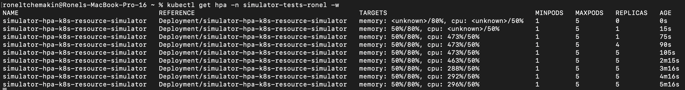
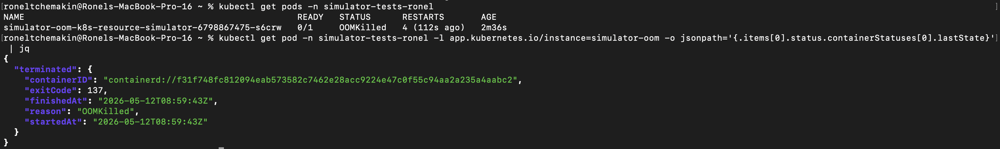
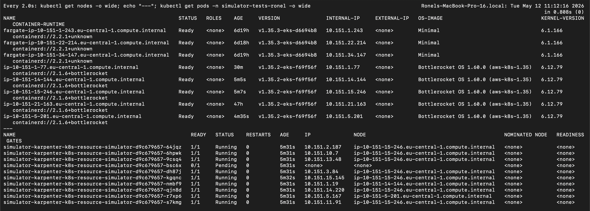

# k8s-resource-simulator

A small CPU/memory load generator for testing Kubernetes resource behaviour — autoscaling, node provisioning, OOM kills, and similar scenarios. Packaged as a Docker image and a Helm chart that consumes [`naviteq/helm-library`](https://github.com/naviteq/helm-library).

[](https://github.com/naviteq/k8s-resource-simulator/actions/workflows/pullrequest.yaml)
[](https://helm.sh)
[](https://github.com/naviteq/k8s-resource-simulator/pkgs/container/k8s-resource-simulator)

> [!WARNING]
> **For testing only.** This tool deliberately wastes CPU and allocates memory it does not use. It is not a benchmark and not meant for production traffic.

## When to use it

- Validate HorizontalPodAutoscaler (HPA) configuration before deploying real workloads
- Trigger node autoscaling (Karpenter / cluster-autoscaler) to verify a cluster scales out under demand
- Reproduce out-of-memory (OOM) conditions for monitoring or alerting tests
- Smoke-test resource requests/limits on a new namespace or cluster

## What it does not do

- It is not a benchmark — CPU consumption is a busy-loop, not a representative workload
- It does not generate network or disk I/O
- It does not expose any service port; it has no HTTP endpoint
- It is not meant for production traffic — only for testing/demos

---

## CLI flags

The simulator binary accepts two flags. At least one must be provided.

| Flag | Type | Default (if other flag is set) | Description |
|------|------|--------------------------------|-------------|
| `-millicores <N>` | int | `100` | CPU consumption in millicores (1000 = 1 vCPU). |
| `-MiB <N>` | int | `10` | Memory allocation in MiB. Allocated once at startup and held. |

```bash
./cpu_mem_simulator -millicores 500 -MiB 256
# Simulating 500 millicores and allocating 256 MiB of memory indefinitely...
```

If neither flag is provided, the simulator exits with a usage message.

---

## Helm values

This chart consumes `naviteq/helm-library` and only documents the values **this chart sets or overrides**. For the full inherited schema (sidecars, scheduling, security contexts, etc.) see the [helm-library values reference](https://github.com/naviteq/helm-library/blob/main/chart/README.md).

| Key | Default | Description |
|---|---|---|
| `image.registry` | `ghcr.io` | Container registry |
| `image.repository` | `naviteq/k8s-resource-simulator` | Image path |
| `image.tag` | `""` (falls back to `appVersion`) | Image tag |
| `image.pullPolicy` | `IfNotPresent` | Image pull policy |
| `args` | derived from `resources.requests` (see below) | Container args passed to the simulator binary |
| `resources.requests.cpu` | `500m` | CPU request — also drives the `-millicores` arg by default |
| `resources.requests.memory` | `512Mi` | Memory request — also drives the `-MiB` arg by default |
| `resources.limits.memory` | `512Mi` | Memory limit |
| `ports` / `service.ports` | `[]` / `[]` | Service rendering is suppressed (the simulator is not network-facing) |
| `pdb.create` | `false` | PodDisruptionBudget rendering is suppressed |
| `autoscaling.enabled` | `false` | Enable HPA |
| `autoscaling.minReplicas` / `maxReplicas` | `1` / `3` | HPA replica range |
| `autoscaling.targetCPU` / `targetMemory` | `80` / `80` | HPA target utilization (%) |
| `serviceAccount.create` | `false` | Create a dedicated ServiceAccount |

### Args auto-derivation

By default, `args` is computed from `resources.requests` via Helm `tpl` expressions:

```yaml
args:
  - "-millicores"
  - '{{ .Values.resources.requests.cpu | replace "m" "" }}'
  - "-MiB"
  - '{{ .Values.resources.requests.memory | replace "Mi" "" }}'
```

So `cpu: 500m` and `memory: 512Mi` produce `-millicores 500 -MiB 512` automatically. Override `args` explicitly to make the simulator consume a different load than its request (used by the HPA and OOM recipes below).

---

## Recipes

Three scenarios verified against an AWS EKS cluster. Each recipe has a values file in [`helm/examples/`](./helm/examples). After each recipe, clean up with:

```bash
helm uninstall <release> -n simulator-tests
```

### 1. HPA scale-up

Force CPU usage well above the request so HPA scales the deployment out. Values: [`helm/examples/hpa.yaml`](./helm/examples/hpa.yaml).

```bash
helm install simulator-hpa \
  oci://ghcr.io/naviteq/k8s-resource-simulator/k8s-resource-simulator \
  --version 0.2.0 \
  -n simulator-tests --create-namespace \
  -f helm/examples/hpa.yaml

kubectl get hpa -n simulator-tests -w
```

CPU utilization climbs to ~473% (against the 50% target), HPA scales replicas from 1 → 4 → 5 (capped at `maxReplicas`).



---

### 2. OOM kill

Tell the simulator to allocate more memory than the K8s limit allows. The kernel kills the container with exit code 137. Values: [`helm/examples/oom.yaml`](./helm/examples/oom.yaml).

```bash
helm install simulator-oom \
  oci://ghcr.io/naviteq/k8s-resource-simulator/k8s-resource-simulator \
  --version 0.2.0 \
  -n simulator-tests --create-namespace \
  -f helm/examples/oom.yaml

kubectl get pods -n simulator-tests
kubectl get pod -n simulator-tests -l app.kubernetes.io/instance=simulator-oom \
  -o jsonpath='{.items[0].status.containerStatuses[0].lastState}' | jq
```

Pod status shows `OOMKilled` with `RESTARTS` climbing. The `lastState.terminated` block shows `reason: OOMKilled, exitCode: 137`.



---

### 3. Karpenter node provisioning

Deploy more pods than the cluster has capacity for. Karpenter provisions new EC2 nodes to fit them. Values: [`helm/examples/karpenter.yaml`](./helm/examples/karpenter.yaml).

> Requires an AWS EKS cluster with Karpenter installed.

```bash
helm install simulator-karpenter \
  oci://ghcr.io/naviteq/k8s-resource-simulator/k8s-resource-simulator \
  --version 0.2.0 \
  -n simulator-tests --create-namespace \
  -f helm/examples/karpenter.yaml

watch 'kubectl get nodes -o wide; echo "---"; kubectl get pods -n simulator-tests -o wide'
```

Initially pods are `Pending` (existing nodes don't have free capacity for all 10). Within ~60 seconds Karpenter provisions new EC2 nodes (visible as fresh `ip-<...>` entries with low `AGE`), and pods schedule onto them.



---

## Image distribution

The simulator's container image is published to **GitHub Container Registry (GHCR)** on every release.

| Detail | Value |
|---|---|
| Registry | `ghcr.io` |
| Image | `ghcr.io/naviteq/k8s-resource-simulator` |
| Tag format | `MAJOR.MINOR.PATCH` (no `v` prefix), plus moving tags `MAJOR.MINOR` and `MAJOR` |
| Available tags | See [GHCR package page](https://github.com/naviteq/k8s-resource-simulator/pkgs/container/k8s-resource-simulator) |

Releases are automated via [release-please](https://github.com/googleapis/release-please): merges to `main` with Conventional Commits accumulate, then a release PR bumps `Chart.yaml`'s `version`/`appVersion` and tags `vX.Y.Z`. The tag triggers [`.github/workflows/release.yaml`](./.github/workflows/release.yaml), which builds and pushes the multi-arch image to GHCR and the Helm chart to `oci://ghcr.io/naviteq/k8s-resource-simulator/k8s-resource-simulator`.

### Consuming the Helm chart

```yaml
# In your Chart.yaml
dependencies:
  - name: k8s-resource-simulator
    version: 0.2.0
    repository: oci://ghcr.io/naviteq/k8s-resource-simulator
```

Or install directly:

```bash
helm install <release> \
  oci://ghcr.io/naviteq/k8s-resource-simulator/k8s-resource-simulator \
  --version 0.2.0
```

---

## Troubleshooting / known limits

- **Maximum memory request** — the simulator calls `malloc(MiB * 1024 * 1024)` once at startup. Practical ceiling is whatever the container's memory limit allows. Above a few GiB you may see allocation failures.
- **cgroups v1 vs v2** — the simulator does not read cgroup limits itself; it consumes exactly the millicores/MiB you tell it to. The kernel enforces K8s limits identically on both cgroup versions (kill on memory excess, throttle on CPU excess). The OOM recipe reproduces the same way on either.
- **Image pull errors with `:vX.Y.Z` tag** — Docker image tags do **not** include the `v` prefix even though git tags do (`v0.2.0` git tag → `0.2.0` image). Use `image.tag: "0.2.0"` or leave empty so the chart falls back to `appVersion`.
- **Helm 4 OCI mediatype error** — Helm 4 cannot read charts pushed by Helm 3. Use Helm 3 (≥ 3.12) to install this chart.
- **OCI install URL** — the chart-name suffix is required: `oci://ghcr.io/naviteq/k8s-resource-simulator/k8s-resource-simulator`. Omitting the trailing `k8s-resource-simulator` returns the mediatype error above.

---

## Contributing

Contributions welcome via pull request. The chart is a thin consumer of [`naviteq/helm-library`](https://github.com/naviteq/helm-library) — any chart-level changes (resource types, defaults, value names) should generally land there, not here.
